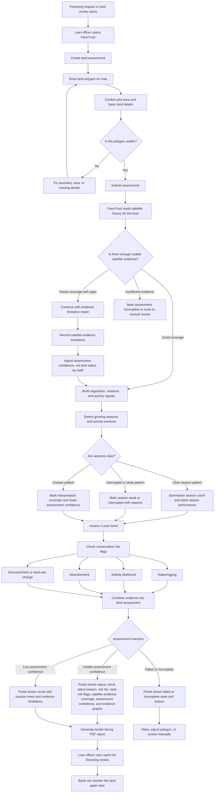

# PROJECT
Purpose: single place for product truth (vision, scope, current roadmap, open questions).

## Links
- DECISIONS entry: <YYYY-MM-DD — Decision: ...>
- ENGINEERING section: <ENGINEERING §...>
- TASK: <T-xx — name>

## Vision
- Produce lender-facing farm risk reports from satellite time-series evidence so banks and
  agri-financiers can review agricultural credit-readiness faster and with clearer evidence.
- FarmTrust is decision support: it provides risk evidence, confidence notes, and reports; it does not approve or reject loans.

## Positioning
- Product hierarchy: risk assessment first, monitoring second, AI explanation alongside both, data-company expansion later.
- The first product is a lender-facing farm risk report. Monitoring continues the same evidence trail after the first report.
- AI is an explanation layer for report evidence, visuals, score reasons, confidence notes, and monitoring changes; it does not create assessment evidence or scores.
- FarmTrust does not start as a general agriculture platform. Broader data products become credible only after enough validated usage exists.

## Working principles
- Protect core scope and technical truth, while encouraging optional improvements that help the team or user outcomes.
- Use judgment: if an improvement changes shared truth, reflect it in the relevant canonical doc.

## Problem
- Financiers lack objective land-risk evidence before and during agricultural financing; they rely on
  paperwork, collateral, trust, or one-off visits and cannot see multi-year activity, trend, or operational risk clearly.

## Users
- Loan officers and agri-finance analysts evaluating financing requests.
- Portfolio managers monitoring land performance over time.

## Outputs (what the user sees)
- Lender-facing farm risk report that supports credit-readiness review.
- Land status: active / intermittent / inactive.
- 2-year trend: improving / stable / declining.
- Last-season performance: good / interrupted / weak, with short reasons.
- Risk tier: low / medium / high, presented as decision support rather than automated loan approval.
- Risk flags: waterlogging, salinity likelihood, abandonment, encroachment / land-use change.
- Satellite evidence coverage: good / fair / limited / insufficient.
- Assessment confidence: high / medium / low, meaning confidence in FarmTrust's assessment reliability, not confidence in the land itself.
- Smoothed evidence graphs for the most valuable time-series signals (NDVI, EVI, NDMI, NDWI).
- Season count across the selected interval, with season boundaries explained visually.
- **Evidence Packet Report Card** (portal route `/lands/[id]/packet`): a structured, grounded lender report showing Observed findings, Interpreted claims with per-claim confidence and evidence trail, a split risk register (land_risk vs evidence_limitation), track record, cautious indicators, and a fixed "what this does NOT tell you" boundaries block. Deterministic and byte-consistent, inventing no new evidence; built during the worker's report_generation phase. Distinct from and linked alongside the PDF export at `/lands/[id]/report`.
- PDF report export for lender review.

## Current-build scope (what we ship first)
- Initial lender-facing farm risk assessment/report is the product anchor; monitoring is a follow-up layer after the first report.
- Satellite-only assessment for a single land polygon.
- AOI input via polygon draw: the user clicks land corners on a map to define the analysis area.
- Geography: Egypt national coverage in current build.
- Plot size bounds: 1–200 feddan.
- Two-year behavior + trend indicators and last-season performance summary.
- Simple, explainable report suitable for financing review.
- Lightweight portal: lands-only list, one-page land summary, optional map tab.
- Current-build assessment must be based on interval-level evidence, not a single latest observation.
- Validation approach: weak labels only; add public-area qualitative reviews when feasible.
- Risk flags use conservative thresholds to protect trust in current-build outputs.
- Abandonment and inactivity interpretations are governed by a conservative absence gate (activity_present / absence_supported / absence_uncertain / not_assessed) and a history-coverage check (sufficient / limited / insufficient); insufficient evidence lowers confidence rather than asserting abandonment.
- Current-build execution uses a single-job worker path; queue/broker is deferred until multi-user needs.

## Current Build ownership (6 roles)
- Product/Tech lead: scope, interfaces, decision reviews, demo readiness.
- Data ingestion: satellite access, AOI mapping, time-series extraction, and minimal persistence.
- ML/time-series preprocessing: gap handling, smoothing, confidence inputs.
- ML/seasonal analysis: historical pattern + seasonal analysis outputs for scoring.
- ML/scoring: status/trend/season, flags, evidence, and assessment confidence.
- Frontend: AOI input UI, summary view, evidence display, PDF export.

## R&D working rules
Problem this solves: frequent back-and-forth and overlapping work cause drift, rework, and integration churn.
- Time-boxed research spikes (3-5 days): each role runs short experiments; outcomes are either (a) ready to integrate, (b) needs more time with a clear next hypothesis, or (c) dropped.
- Optional improvements are welcome and encouraged when they help the team; preserve scope/technical truth and record any shared-truth changes.
- Decision authority: lead by default for scope/timeline decisions; group for research-method decisions.
- Flexible schema: no hard freeze, but any schema change must be announced before weekly integration, include a migration note (what changed + why), and update the relevant truth doc section.
- Prototype policy: R&D outputs must be labeled "prototype/throwaway" until promoted; production use requires an explicit decision.
- Risk ownership: top 3 risks get an owner and a mitigation note, reviewed weekly.
- Validation cadence: role-level validation weekly; cross-team integration review at weekly checkpoint.

## Non-goals
- Automated financing decisions.
- Exact crop type labeling or numeric yield prediction.
- Field surveys or ground sensors as core inputs.
- AI-generated risk scores, unsupported agronomic claims, pest diagnosis, or legal surveying.

## Claim discipline
- Built/current-build claim: satellite-to-risk-report foundation with interval evidence, conservative risk outputs, confidence-aware assessment, portal/API foundation, and report export.
- Research/background claim only when separately demonstrated: completed crop mapping and yield estimation work is background research, not active product scope or roadmap.
- Future claim: monitoring at scale, AI assistant workflows, data products, cooperative/government analytics, and statistics use cases.
- Not claimed: automated loan approval, exact guaranteed yield, pest diagnosis, or legal land surveying.

## Big picture (end-to-end)
Inputs → Processing → Outputs → Workflow.
- Inputs: land polygon drawn on a map; time window (last 24 months).
- Processing: satellite time-series indicators → evidence coverage check → interpretation rules → assessment confidence.
- Outputs: land status, trend, season performance, risk tier, land risk flags, satellite evidence coverage, assessment confidence, report.
- Workflow: pre-financing review → monitoring during financing → post-season review.

## Open questions
- [clarification needed] Should season segmentation cap cycles per year (e.g., 1–3) or be fully data-driven?
- [clarification needed] What numeric false-alarm threshold defines "very low" for pilot use?

## Future ideas
- Non-committed future ideas are parked in `FUTURE.md`; they are not scope, roadmap, or architecture truth.

## Roadmap
- Current Build: lender-facing farm risk assessment/report + lands-only portal + PDF export; minimal persistence only; pilot validation with low confusion and very low false alarms.
- Next: validate the risk-report flow end to end, sharpen lender-safe scoring language, and plan monitoring/AI as follow-up layers without changing the first-product anchor.
- Later: promote monitoring at scale, AI assistant workflows, data-company expansion, and other explicitly approved future ideas only after validation and explicit decisions.
- Future ideas are intentionally isolated in `FUTURE.md` and must be re-evaluated before becoming scope or a live task.

## Exploration Gate
- Current-build scope written
- Top open questions prioritized
- Active options capped with evidence and decision triggers; non-committed ideas parked in `FUTURE.md`
