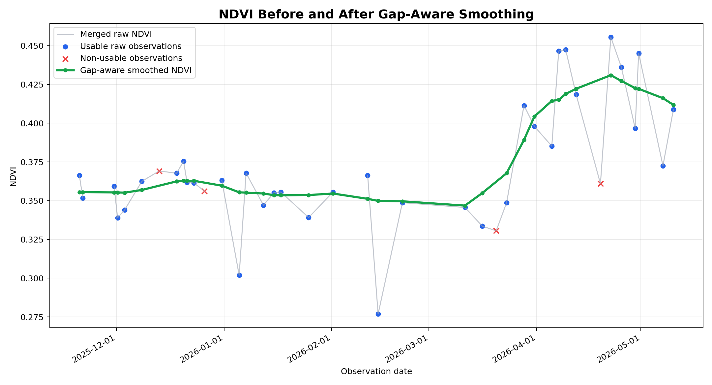
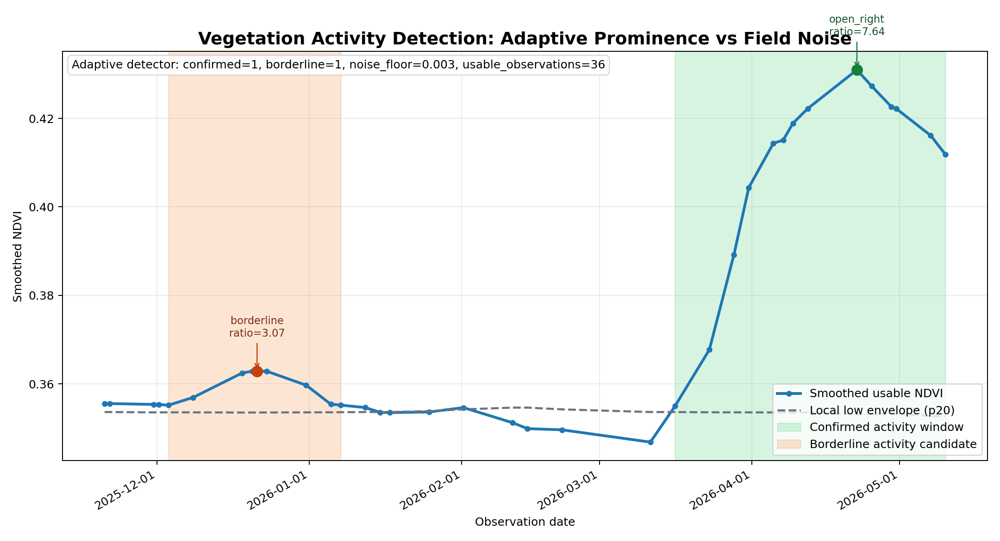

# Pipeline Walkthrough

This is a conversational guide for explaining the pipeline to a professor or reviewer. It keeps the original learning flow, but removes raw chat labels so it reads as a walkthrough.

Starting understanding: the user provides an AOI for the land as a polygon. We create a bounding box around that polygon, use it to search STAC for Sentinel-2 scenes over the selected assessment interval, load the relevant AOI window into a time-sorted cube, then mask everything outside the original polygon during statistics. After that, we calculate the valid fraction inside the polygon.

## Pipeline Ingestion — Explanation Guide

### Big Picture

The ingestion stage takes a **farmer's land parcel** (drawn as a polygon on a map) and produces a **per-solar-day time series of vegetation & moisture indices** over the selected assessment interval. It answers: *"For every Sentinel-2 solar day over this field, what fraction was cloud-free and what were the index values?"*

---

### Step-by-step Walkthrough

**1. AOI → Bounding Box**

The user draws a polygon (GeoJSON). Since STAC APIs only search by rectangular bounding box, we compute the minimal axis-aligned rectangle that encloses the polygon.

- **Code:** `config.py:geometry_to_bbox()` — iterates polygon vertices, takes min/max lon/lat.
- **Why not search by polygon directly?** STAC does support `intersects` (geometries), but:
  - Planetary Computer search is simpler/more reliable with bbox
  - COG reads also use a rectangular window, so we need the bbox anyway

**2. STAC Search — Find Relevant Scenes**

We query **Planetary Computer's STAC catalog** for `sentinel-2-l2a` (atmosphere-corrected surface reflectance) that:
- Overlaps the bbox
- Falls within the selected date window (legacy/default examples may still use 24 months)
- Has `eo:cloud_cover < 30%` (coarse pre-filter)

- **Code:** `cube_pipeline.py:466-472` — `catalog.search(bbox=bbox, datetime=..., query={...})`
- **Key detail:** The STAC client is opened with `modifier=pc.sign_inplace` — this automatically signs SAS URLs so they don't expire mid-run.

**3. Solar-Day Grouping — Mosaic All Overlapping Tiles**

Multiple Sentinel-2 items can land on the same calendar date because the AOI may cross tile boundaries or receive overlapping passes. The current path groups items by **solar day** and lets `odc.stac.load(groupby="solar_day")` mosaic the overlapping items into one aligned day slice.

This is different from the old per-scene dedup path: we do not choose one "best" tile and discard the others. For boundary AOIs, mosaicking is the correctness fix because every overlapping tile can contribute pixels.

- **Code:** `cube_pipeline.py:_group_by_solar_day()` and `cube_loader.py:load_day_cube()`

**4. Phase 1 Download — Write Raw Pixels Into `cube.zarr`**

This is the core efficiency and traceability win. Instead of downloading full Sentinel-2 tiles, `odc.stac.load` reads the rectangular AOI bbox window from the cloud assets, aligns requested bands on the needed UTM grid, and returns raw DN pixels for that solar day.

- **Code:** `cube_loader.py:load_day_cube()` and `cube_pipeline.py:download_cubes()`
- **How it works:**
  1. Estimate or accept a target UTM CRS for the AOI.
  2. Load default bands `B02`, `B03`, `B04`, `B08`, `B11`, and `SCL`; optionally backfill extra bands such as `B05`, `B06`, `B07`, `B8A`, and `B12`.
  3. Store 10m bands on the root grid and native 20m bands in the `20m` group. Use nearest-neighbor for categorical `SCL` only when aligning it for processing.
  4. Keep raw integer DN values in the cube; do not apply reflectance scaling during download.
  5. Region-write each completed day into `cube.zarr`; fresh cubes are written sorted, while date-range extensions append only missing days and then compact the local Zarr store back into physical time order.

- **Why this matters:** The cube is reusable and repairable. If the configured date window is extended, Phase 1 downloads only missing solar days; if one band is missing or a new band is requested, Phase 1 downloads only that band for existing real days. If the SCL policy or index formulas change, Phase 2 can reprocess local pixels without re-downloading from Planetary Computer.

- **Windows write safety:** Per-day chunks and a small Zarr region-write retry prevent transient file-lock failures while writing stats or pixels.

**5. Phase 2 Processing — Polygon Mask Applied**

After opening `cube.zarr`, Phase 2 masks out everything **outside the original polygon** so indices only reflect the actual land parcel.

- **Code:** `cube_stats.py:make_aoi_mask()` and `cube_stats.py:compute_day_stats()`
- **Process:**
  1. Transform polygon from EPSG:4326 to the cube's UTM CRS.
  2. Rasterize the polygon onto the cube grid: `True` inside polygon, `False` outside.
  3. Apply this mask before computing valid fraction and index statistics.

- **Why this matters for your professor:** It means the indices are computed **only over the actual field boundary**, not the surrounding area that happened to be in the bbox.

**6. SCL Masking & Valid Fraction**

Sentinel-2 includes a **Scene Classification Layer (SCL)** — a per-pixel classification (vegetation, cloud, shadow, snow, etc.). We use it to filter out unreliable pixels.

Invalid classes (from `cube_pipeline.py:82`):
```
{0: no data, 1: saturated, 3: cloud shadow, 7: low-probability cloud,
 8: medium-probability cloud, 9: high-probability cloud, 10: thin cirrus, 11: snow/ice}
```

**Valid fraction** = `(valid pixels inside polygon) / (all pixels inside polygon)`

- `valid` = pixels whose SCL class is NOT in the invalid set
- **Not the same as `eo:cloud_cover`** — that's a tile-level metadata estimate. `valid_fraction` is AOI-specific, computed from the actual pixel classification within your field boundary.
- **Code:** `cube_stats.py:compute_day_stats()`

**7. Index Computation**

Five vegetation/water indices are computed over valid pixels only:

| Index | Formula | What it tells you |
|---|---|---|
| NDVI | (NIR - Red) / (NIR + Red) | Vegetation greenness / biomass |
| EVI | 2.5×(NIR-Red) / (NIR+6×Red-7.5×Blue+1) | Vegetation, better in dense canopy |
| NDMI | (NIR - SWIR1) / (NIR + SWIR1) | Moisture content |
| NDWI | (Green - NIR) / (Green + NIR) | Open water |
| MNDWI | (Green - SWIR1) / (Green + SWIR1) | Water, better for built-up areas |

Before computing indices, raw Sentinel-2 DN is converted to surface reflectance using the post-2022 BOA baseline rule: `(DN - 1000) / 10000`; DN=0 is treated as nodata.

Each index returns **mean** and **95th percentile** over valid pixels.

- **Code:** `cube_stats.py:apply_boa_offset()`, `cube_stats.py:compute_day_stats()`, `indices.py`

**8. Output Artifacts**

For each AOI run, four outputs are produced:

- **`cube.zarr`** — Primary source artifact. Raw DN pixels, source provenance, and root attrs live on one sorted time axis. The root group stores 10m bands; the `20m` group stores native 20m bands such as `B11`, `SCL`, and red-edge bands.
- **`indices_timeseries.csv`** — Derived downstream handoff. One row per solar-day mosaic with `timestamp`, representative `item_id`, `valid_fraction`, and all index stats. Recompute this from `cube.zarr` when processing policy changes.
- **`scenes_index.jsonl`** — v4+ operational ledger. One append-only record per attempted solar day with `cache_key`, day `status`, and optional per-band `band_status`; it is authoritative about which cube slots and bands are real.
- **`run_metadata.json`** — Run config and Phase 2 config read-path for downstream auditability.

---

### The Key Design Decisions (for your professor's questions)

**"Why not just download the full tile?"**
Each Sentinel-2 tile is large, and the AOI window is typically a tiny fraction of it. The ODC cube path reads only the bbox window needed for the AOI and persists that compact subset in `cube.zarr`.

**"How do you handle different band resolutions?"**
Visible/NIR bands (`B02`, `B03`, `B04`, `B08`) are stored on the 10m root grid. Native 20m bands (`B05`, `B06`, `B07`, `B8A`, `B11`, `B12`, `SCL`) are stored in the `20m` group to avoid upscaling storage. Phase 2 aligns 20m bands temporarily in memory only when an index or mask needs a shared grid.

**"What if the AOI is on the edge of a tile or spans multiple tiles?"**
Items from the same solar day are mosaicked, so overlapping tiles can jointly cover the AOI. If the AOI polygon has zero pixels on the cube grid, Phase 2 marks the day `empty_aoi` and skips it.

**"Why compute both mean and p95?"**
Mean is sensitive to the overall distribution. P95 captures the "best" pixels — useful when a field has mixed conditions (e.g., partial irrigation).

**"What about caching?"**
Each solar day has a **fingerprint** based on the AOI identity (geometry and bbox), CRS, resolution, cloud threshold, SCL classes, and offset policy. If a day was previously downloaded with the same fingerprint and requested bands exist, it can be skipped or replayed from the cube. Missing requested bands are backfilled independently. The date range itself is not part of the per-day key; extending to days absent from an existing `cube.zarr` downloads only those missing solar days, then physically sorts/compacts the local cube.

---

### If your professor asks "What comes next?"

The `indices_timeseries.csv` feeds into:
1. **Preprocessing** (`preprocess_timeseries.py`) — strict usable-observation gate, model-derived analysis curve, p95/spread and MNDWI pass-through, gap analysis, quality metrics
2. **Seasonal analysis** (`seasonal_analysis.py`) — detecting vegetation activity windows from the model-derived curve, with boundary provenance and nearest real-observation support
3. **Land assessment** (`scoring/`) — rule-based classification with history coverage, absence gate, trend when supported, conservative risk/watch flags, confidence

That leads into the downstream stages: preprocessing, activity-window analysis, and assessment.

### Quick Example: `indices_timeseries.csv`

Here's what a row in `indices_timeseries.csv` looks like — formatted as a table for clarity:

| item_id | timestamp | mgrs_tile | eo_cloud_cover | valid_fraction | ndvi_mean | ndvi_p95 | evi_mean | evi_p95 | ndmi_mean | ndmi_p95 | ndwi_mean | ndwi_p95 | mndwi_mean | mndwi_p95 |
|---|---|---|---|---|---|---|---|---|---|---|---|---|---|---|
| `S2B_36RTV_20260601_0_L2A` | `2026-06-01T09:24:31Z` | `36RTV` | 12.3 | 0.92 | 0.71 | 0.88 | 0.42 | 0.55 | 0.35 | 0.48 | -0.21 | -0.08 | 0.15 | 0.29 |
| `S2A_36RTV_20260527_0_L2A` | `2026-05-27T09:27:14Z` | `36RTV` | 25.1 | 0.78 | 0.65 | 0.82 | 0.38 | 0.51 | 0.31 | 0.44 | -0.18 | -0.05 | 0.12 | 0.26 |
| `S2B_36RTV_20260522_0_L2A` | `2026-05-22T09:24:52Z` | `36RTV` | 5.1 | 0.97 | 0.73 | 0.89 | 0.44 | 0.57 | 0.36 | 0.49 | -0.22 | -0.09 | 0.16 | 0.30 |

**Key readings from the data:**

- **Jun 1** (12% cloud → `valid_fraction=0.92`): 92% of the field pixels are usable. NDVI mean=0.71 is a strong vegetation signal, not a crop/yield claim.
- **May 27** (25% cloud → `valid_fraction=0.78`): cloudier, so fewer usable pixels, but indices are still reliable because we mask clouds out via SCL, not just drop the whole scene.
- **May 22** (5% cloud → `valid_fraction=0.97`): cleanest pass — NDVI 0.73, NDMI 0.36. NDMI is treated as a moisture signal, not proof of irrigation, crop health, or yield.

The CSV is sparse by design — irregular timestamps, one row per satellite pass, and no interpolation at ingestion. Downstream preprocessing creates model-derived filled/smoothed values only at observed timestamps; it still does not create invented daily dates.

### Brief Next-Step View

Here's the high-level pipeline flow after ingestion:

```
  ┌─────────────┐
  │  Ingestion  │  ← we just covered this (STAC → COG → mask → CSV)
  │  (you are   │
  │   here)     │
  └──────┬──────┘
         ↓
  ┌─────────────┐
  │ Preprocess  │  Clean the noisy time series: smooth, flag gaps, mark usable scenes
  └──────┬──────┘
         ↓
  ┌─────────────┐
  │  Seasonal   │  Detect vegetation activity windows from the smoothed NDVI analysis curve
  │  Analysis   │  (start/peak/end dates, quality labels)
  └──────┬──────┘
         ↓
  ┌─────────────┐
  │    Land     │  Final answer: active? declining? risk flags? confidence?
  │ Assessment  │  Combines everything into a decision
  └─────────────┘
```

**4 stages, 4 scripts, one AOI.** Each stage reads the previous stage's output files. The chain is:

1. **Preprocessing** — takes the irregular CSV, keeps strict usable observations (`valid_fraction ≥ 0.90`) as evidence anchors, builds filled/smoothed model-derived analysis values at observed timestamps, carries p95/spread and MNDWI, and flags long observation gaps
2. **Seasonal analysis** — looks at the model-derived NDVI analysis curve, finds vegetation activity windows using peak/trough + per-cycle amplitude logic with threshold fallback, and records boundary provenance plus nearest real-observation support
3. **Land assessment** — combines everything to classify current activity only when evidence supports it, separate history coverage from land status, gate absence/inactivity claims, expose cautious indicators, and report confidence

**TL;DR for your professor:** *Ingestion gives us a raw time series. Preprocessing cleans it. Seasonal analysis finds the growing windows. Assessment makes the final call.*

## Preprocessing — Detailed Explanation

### The Problem It Solves

The ingestion CSV has **raw, uneven, noisy** data. On a single day, you might get 2-3 scenes from different satellite passes with slightly different values. Cloudy scenes have low `valid_fraction` and unreliable indices. And between clear days, there are gaps where clouds blocked view.

Preprocessing takes this messy signal and produces a **clean, smoothed time series** with explicit quality flags, so downstream seasonal analysis doesn't have to deal with raw noise.

---

### Step-by-Step

**1. Load & Sort**

Read the ingestion CSV, validate required columns exist (`item_id`, `timestamp`, `valid_fraction`, and mean/p95 stats for NDVI, EVI, NDMI, NDWI, and MNDWI), sort all rows by timestamp.

- **Code:** `pipeline.py:100-130` — `load_ingestion_observations()`

**2. Collapse Same-Day Duplicates**

Multiple scenes can fall on the same UTC calendar day (overlapping tiles, S2A + S2B passes). These are **merged into one row per day** using a **valid-fraction-weighted average**:

- Each scene's contribution weight = its `valid_fraction`
- If `valid_fraction` is 0 (all cloudy), weight is clamped to 0
- If total weight is 0, falls back to simple arithmetic mean

**Example:**

| Raw rows (same day) | valid_fraction | ndvi |
|---|---|---|
| Scene A (clear pass) | 0.95 | 0.72 |
| Scene B (cloudy pass) | 0.30 | 0.65 |

→ Merged: NDVI ≈ `(0.72 × 0.95 + 0.65 × 0.30) / (0.95 + 0.30)` = **0.70** (the clear scene dominates)

- **Code:** `pipeline.py:133-171` — `collapse_same_day_observations()`

**3. Filter Usable Observations**

After merging, we apply a **`valid_fraction ≥ 0.90`** threshold. Any observation where less than 90% of the field pixels were usable (cloud-free, not shadow/snow) is marked as **not usable**. Its raw values are kept in the output but it does **not** contribute to smoothing.

- **Why 0.90?** It's conservative — we only trust scenes where almost the entire field is clear. Stricter than `eo:cloud_cover` because it's computed on the **actual polygon**, not the whole tile.

- **Code:** `pipeline.py:206-207`

**4. Smoothing — Whittaker–Eilers Daily-Grid Analysis Curve**

The smoothing method is **`weighted_whittaker_eilers_daily_grid`**. It reconstructs a model-derived analysis curve on a regular **daily** grid in real time, so downstream activity detection sees the full vegetation shape.

**Why this replaced the old approach.** The previous smoother fit a local cubic on the integer *observation index* (and was mislabeled "Savitzky-Golay"). Sentinel-2 sampling is irregular — a ~5-day cadence punctuated by multi-week cloud gaps — so fitting against the index instead of real days distorts the curve: a signal that is linear in time is bent by up to ~0.06–0.12 NDVI where a window straddles a gap. The fix is to smooth in real time on a daily grid.

The method:

1. **Inclusion gate (curve only):** observations with `valid_fraction >= 0.30` become anchors for the analysis curve, each weighted by its `valid_fraction` (clipped to `[0.1, 1.0]`). This is looser than the strict `>= 0.90` *usable* gate, which is left untouched and still drives gaps/evidence — the curve uses more shape information while the evidence layer stays strict.
2. **Phase 1 — Fill:** linearly interpolate across the inclusion-gated anchors to produce a `*_filled` value for every observed timestamp.
3. **Phase 2 — Smooth (Whittaker–Eilers):** build a daily grid spanning the first→last observed date and solve the penalized least-squares system

   `(W + lambda · DᵀD) z = W y`

   where `W` is the diagonal of daily weights (0 on unobserved days), `D` is the 2nd-order difference operator, and `z` is the smoothed daily curve. `DᵀD` is banded and symmetric positive-definite, so the solve is a fast banded factorization (`scipy.linalg.solveh_banded`). This jointly fills gaps (through the roughness penalty) and denoises in one step.
4. **Choosing lambda — phenology timescale, not GCV.** `lambda` controls smoothness. Rather than a magic constant or generalized cross-validation, it is derived from a target smoothing *timescale* in days: for a 2nd-order Whittaker the half-power period `T` satisfies `lambda = (T / 2·pi)^4`, so a ~45-day window gives `lambda ≈ 2631`. This is an agronomic constant (crop phenology responds over weeks, the same everywhere), not a per-AOI fit. GCV was evaluated and rejected as the default: on daily-gridded NDVI it systematically *undersmooths* — on the demo AOI it minimizes at `lambda ≈ 1–10` (≈150–175 effective degrees of freedom, fitting cloud dips and noise) instead of the domain-appropriate `lambda ≈ 2631` (≈29 effective DoF, which recovers the four real crop cycles).
5. **Sample back to observations.** `*_smoothed` is the daily curve sampled at each observation timestamp, so `ndvi_smoothed.csv` keeps exactly one row per observed date. The full daily curve is persisted separately as `season_analysis_curve.csv`.
6. Gap metrics remain separate confidence evidence; filling the analysis curve does not hide gaps. Filled/smoothed values are explicitly **model-derived analysis values**, not direct observation evidence.

**Graph from the current data**



This illustrates the smoothing concept (raw observations vs the reconstructed analysis curve). For a live, interactive view of the current Whittaker curve plus detected cycles, open `outputs/diagnostics/<aoi>/pipeline_visualization.html`.

- Smoothing is applied to **NDVI, EVI, NDMI, NDWI, and MNDWI** independently, sharing one lambda chosen on NDVI so cross-index shapes stay comparable.
- Non-usable observations keep raw values and still receive model-derived filled/smoothed analysis values.
- p95 values are carried as raw spatial statistics; NDVI/MNDWI spread fields are computed as `p95 - mean`.
- Seasonal confirmation and scoring consume the same smoothed EVI, NDMI, NDWI, and MNDWI from preprocessing.

- **Code:** `analysis_curve.py` — `fill_at_observations()`, `build_analysis_curves()`, `whittaker_smooth()`, `select_lambda()`

**5. Gap Analysis**

Even after filtering, the usable observations have **irregular spacing**. Sentinel-2 revisits every ~5 days, but clouds can create longer gaps. Three metrics quantify this:

| Metric | What it is | How it's computed |
|---|---|---|
| **gap_ratio** | Fraction of the total span that is "excess gap" beyond the expected 5-day cadence | `sum(max(0, gap - 5)) / total_span_days`, range [0,1] |
| **max_gap_days** | Longest stretch with no usable observation | simple max of consecutive deltas |
| **median_gap_days** | Typical gap between usable observations | median of consecutive deltas |

Then these drive a **gap risk classification**:

| Condition | Risk Label | Confidence Penalty |
|---|---|---|
| `max_gap > 15 days` OR `gap_ratio > 0.30` | **high** | high |
| `max_gap > 10 days` OR `gap_ratio > 0.15` | **moderate** | moderate |
| otherwise | **low** | low |

- **Code:** `gaps.py` — `compute_gap_metrics()`, `classify_gap_risk()`
- **Design note:** This is NOT land risk — it's **evidence reliability**. A high gap risk means "we can't be as confident in what the land did during that missing period." Land assessment uses this to decide how much to trust its own conclusion.

---

### Outputs

**1. `ndvi_smoothed.csv`** — One row per real merged observation date, sorted by time. It is not a regular daily grid and does not include invented dates. Unlike the earlier pipeline, **every row now has filled and smoothed values**, not only usable rows:

| timestamp | ndvi_raw | ndvi_p95_raw | ndvi_spread_raw | ndvi_filled | ndvi_smoothed | mndwi_raw | mndwi_smoothed | valid_fraction | is_usable |
|---|---:|---:|---:|---:|---:|---:|---:|---:|---|
| 2026-05-01 | 0.30 | 0.36 | 0.06 | 0.30 | 0.31 | -0.30 | -0.29 | 0.96 | true |
| 2026-05-06 | 0.72 | 0.80 | 0.08 | 0.72 | 0.33 | -0.34 | -0.31 | 0.94 | true |
| 2026-05-11 | 0.31 | 0.38 | 0.07 | 0.31 | 0.31 | -0.29 | -0.30 | 0.97 | true |
| 2026-05-20 | 0.65 | 0.75 | 0.10 | 0.50 | 0.49 | -0.20 | -0.25 | 0.78 | false |
| 2026-05-29 | 0.68 | 0.74 | 0.06 | 0.68 | 0.68 | -0.33 | -0.33 | 0.95 | true |

How to read this example:

- May 1, May 6, and May 11 are usable (green bars). Their `ndvi_filled` equals `ndvi_raw` — fill preserves the original at anchors.
- May 20 is below the strict `0.90` *usable* gate (`valid_fraction = 0.78`) so it is not evidence, but it is above the `0.30` curve-inclusion gate, so it still contributes (down-weighted) to the analysis curve; its `ndvi_smoothed` comes from the continuous daily Whittaker curve sampled at that date. This is model-derived analysis support, not a direct observation. (Numbers here are schematic.)
- May 29 is usable and gets the same treatment. Every row is sampled from the one continuous daily Whittaker curve, so the smoothed series is continuous.
- The `*_filled` and `*_smoothed` columns exist for NDVI, EVI, NDMI, NDWI, and MNDWI. p95/spread columns support field-uniformity and surface-water evidence signals.

**2. `quality_metrics.json`** — All the gap/confidence metadata:

```json
{
  "aoi_id": "aoi_demo_01",
  "total_observation_count": 280,
  "merged_observation_count": 280,
  "usable_observation_count": 241,
  "dropped_observation_count": 39,
  "gap_ratio": 0.10,
  "max_gap_days": 15.0,
  "median_gap_days": 3.0,
  "long_gap_count": 4,
  "long_gap_windows": [
    {"start_timestamp": "2024-09-12T00:00:00+00:00", "end_timestamp": "2024-09-24T00:00:00+00:00", "gap_days": 12.0, "excess_gap_days": 7.0},
    ...
  ],
  "gap_risk": "moderate",
  "confidence_penalty": "moderate",
  "smoothing_method": "weighted_whittaker_eilers_daily_grid",
  "interpolation_policy": "linear_fill_between_inclusion_gated_anchors_then_whittaker",
  "fill_policy": "fill_all_observed_timestamps_from_analysis_anchors",
  "analysis_curve_source": "model_derived_weighted_whittaker_daily_curve_sampled_at_observations",
  "analysis_curve_direct_evidence": false,
  "creates_synthetic_timestamps": true,
  "smooths_only_usable_observations": false,
  "whittaker_difference_order": 2,
  "lambda_selection_method": "phenology_timescale_fixed_day_window",
  "target_smoothing_days": 45.0,
  "selected_lambda": 2631.06,
  "lambda_selection_reason": "phenology_timescale",
  "analysis_inclusion_valid_fraction": 0.30,
  "usable_valid_fraction_threshold": 0.9,
  "weighting_policy": "valid_fraction_clipped"
}
```

---

### Common Questions Your Professor Might Ask

**"Why interpolate now when the old pipeline said no interpolation?"**

Two different objectives. The **analysis curve** (what we show to users and use for activity detection) needs continuity so the detector sees full vegetation cycles — filling across gaps with linear interpolation from usable anchors gives the most honest continuous curve without inventing behavior where no data exists. **Gap metrics remain separate evidence** for confidence, so the assessment still penalizes data gaps. The old pipeline refused to fill, which meant seasonal analysis received disconnected fragments and missed real activity windows.

**"Why a Whittaker–Eilers smoother instead of Savitzky-Golay?"**

Savitzky-Golay assumes evenly-spaced samples; Sentinel-2 is irregular (cloud gaps), and an earlier implementation fit on the observation *index* rather than real time, which distorts the curve. The Whittaker–Eilers smoother is the standard choice for irregular, gappy vegetation time series: it works on a real-time daily grid, jointly fills gaps and denoises through a single penalized least-squares solve, and lets each observation carry a quality weight (`valid_fraction`). Its one smoothness knob (`lambda`) is set from a phenology timescale (~45 days), so it preserves real peaks and bare-soil troughs while suppressing cloud dips — without per-AOI tuning.

**"Why not pick lambda automatically with cross-validation?"**

We tried generalized cross-validation (GCV) and rejected it as the default: on daily-gridded NDVI it undersmooths badly (minimizing at `lambda ≈ 1–10`, fitting noise). A phenology-timescale lambda is both more robust and more explainable — "we smooth vegetation over roughly five weeks" is a sentence a reviewer can audit.

**"What does `is_usable = false` mean for downstream now?"**

The `is_usable` flag remains as an **evidence flag** — it tells downstream that the observation had low valid_fraction and should be treated with caution. But every row now has `*_filled` and `*_smoothed` values regardless. Seasonal analysis and scoring use the full curve; the evidence flag and gap metrics are what lower confidence, not the absence of smoothed values.

---

**Summary for your professor:** *Preprocessing merges same-day duplicates weighted by quality, marks usable observations with a 0.90 valid_fraction threshold, and reconstructs a model-derived analysis curve with a quality-weighted Whittaker–Eilers smoother on a daily grid (lambda set from a ~45-day phenology timescale), sampled back to the observed timestamps. It also carries p95/spread and MNDWI evidence signals. Gap metrics remain separate as confidence evidence — the analysis curve does not hide observation gaps from the assessment.*

## Seasonal Analysis — Detailed Explanation

### The Problem It Solves

Preprocessing gives you a smooth NDVI curve over time, but it's just a sequence of numbers. Seasonal analysis answers: *"When did the farmer actually grow something? How many seasons in the last 2 years? Were they good seasons or weak ones?"*

It turns a signal into **discrete events** — growing windows with start, peak, end dates and quality labels.

---

### Step-by-Step

**1. Load All Smoothed Data**

It reads the preprocessing CSV and uses **every row** that has `ndvi_smoothed`. Since the fill+smooth pipeline produces values for all observed timestamps, no rows are filtered out by `is_usable`. The `is_usable` evidence flag remains available for gap-overlap and confidence calculations, but the detector itself sees the full continuous curve.

- **Code:** `seasons.py:109-144` — `load_preprocess_observations()`

**2. Find Candidate Activity — Peak/Trough + Amplitude, with Threshold Fallback**

The detector now uses a deterministic peak/trough activity-cycle path first, then keeps the older threshold path as a fallback/guardrail. This matches the T-11 decision: evolve the FarmTrust detector instead of replacing it with HMM or copying the isolated script blindly.

Plain meaning:

- **Peak:** highest greenness point in one vegetation activity cycle.
- **Trough:** low greenness point before or after that cycle.
- **Amplitude:** height of the cycle, usually `peak - trough`.
- **Boundary:** the point where the curve rises/falls enough above the trough to count as activity start/end.

The boundary threshold uses about 20% of the cycle amplitude:

```text
boundary = trough + 0.20 * (peak - trough)
```

Example:

```text
NDVI:       0.15  0.25  0.45  0.75  0.50  0.28  0.16
Shape:      low          rise  peak         fall  low
```

Here:

```text
trough = 0.15
peak = 0.75
amplitude = 0.60
20% boundary = 0.15 + (0.20 * 0.60) = 0.27
```

So the activity cycle starts when NDVI rises above about `0.27`, peaks at `0.75`, and ends when it falls back near/below `0.27`.

```text
NDVI:       0.15  0.25  0.45  0.75  0.50  0.28  0.16
Boundary:         below above above above above below
Cycle:                 START ------------ END
```

The threshold fallback still protects against messy curves:

- Confirmed activity uses `max(0.35, global_baseline + 0.10)`.
- Borderline activity uses `max(0.20, global_baseline + 0.05)`.
- Peak/trough and threshold candidates are merged, then non-overlapping best candidates are retained.

```
NDVI
 0.7 │            ▄▄▄▄▄▄▄
 0.6 │         ▄▄▤        ▄▄▄
 0.5 │       ▄▤                ▄      ← peak/trough candidate or confirmed threshold
 0.4 │     ▄▤                    ▄
 0.3 │   ▄▤       ████████████    ▄   ← 20% amplitude boundary zone
 0.2 │ ▄▤         merge zone        ▄
 0.1 │▤        (≤ 15 days gap)        ▄
     └──────────────────────────────────── time
```

- **Code:** `seasons.py` — `detect_activity_windows()`, `_candidate_from_peak()`, `_find_threshold_activity_candidates()`

**3. Bound the Activity Window**

After finding a candidate peak, the detector bounds the activity window using the relative 20% amplitude boundary. This keeps boundaries field-relative instead of tied only to a universal NDVI value.

- If the curve is still rising at the final observation, the window is `open_right`.
- If the curve was already active at the first observation, the window is `open_left`.
- Open windows are retained but marked `provisional` because the full biological start/end was not observed.

**4. Filter Out Noise — Minimum Requirements**

A brief or weak blip is not a season. Two filters remove false positives:

| Filter | Value | Why |
|---|---|---|
| Min observations | **4** smoothed points | Need enough data to confirm a pattern |
| Min duration | **20 days** | A real activity cycle spans weeks, not days |

If the curve starts in the middle of an activity cycle, it is no longer silently excluded. It is emitted as `open_left`, with `start_boundary_certainty = "open"` and `provisional = true`.

- **Code:** `seasons.py` — adaptive candidate detection and lifecycle classification in `detect_activity_windows()` / `detect_season_windows()`

**Graph from the current data**



How to read it:

- The green line is the smoothed NDVI signal.
- The confirmed threshold line and borderline threshold line are shown for reference.
- Peak/trough candidates estimate field-relative cycle boundaries; threshold candidates are kept as fallback.
- Confirmed windows become `seasons[]` and count toward `season_count`.
- Borderline windows are reported separately in `borderline_windows[]` and do not count as confirmed seasons.
- Incomplete windows are preserved as `open_right` or `open_left` instead of being treated as finished seasons.
- In the current `aoi_demo_01` manual check, the detector finds **4 confirmed complete activity windows**. Boundary fields say they came from the `model_derived_analysis_curve`, and nearest real observation support dates are recorded beside them.

**5. Label Quality — Good / Interrupted / Weak**

Each detected season gets a quality label based on signal shape:

**Peak NDVI** — How lush did the window get?
**Lifecycle status** — Did we observe a complete cycle, or is it still open?
**Max single-step drop** — Did the signal crash suddenly relative to its amplitude?

| Label | Conditions | What it means |
|---|---|---|
| **Good** | Complete window with peak NDVI >= 0.50 and strong confirmation | Strong observed activity window |
| **Interrupted** | Large one-step drop relative to window amplitude | Activity signal has a sharp interruption-like dip |
| **Weak** | Confirmed but weaker or provisional signal shape | Activity exists, but confidence in strength is lower |

- **Code:** `seasons.py:214-255` — `_label_quality()`

**6. Multi-Index Confirmation — Does NDVI Tell the Whole Story?**

NDVI alone can be fooled (e.g., green weeds on wet soil). The detector cross-checks three other indices:

| Check | Condition | What it tests |
|---|---|---|
| EVI behavior | Relative support near the NDVI peak | Is vegetation really there? EVI is better at dense canopy |
| NDMI behavior | Relative support near the NDVI peak | Is moisture context consistent with vegetation? |
| NDWI behavior | Does not spike like water near the NDVI peak | Helps avoid water/cloud contamination false positives |

If all three support the season → **strong** confirmation. If only 1-2 → **weak** or **moderate**.

Multi-index confirmation is reported as `strong`, `moderate`, or `weak`. It explains support from other indices, but the main activity decision remains based on adaptive NDVI prominence and evidence quality.

- **Code:** `seasons.py:270-309`

**7. Gap Overlap — Did the Satellite Miss a Critical Moment?**

Seasons detected during periods with long observation gaps get flagged. The detector checks if each season window overlaps a **long gap window** (from preprocessing), and classifies which **stage** was affected:

| Stage | What it means | Risk |
|---|---|---|
| Onset | Gap hid the very start of growth | **high** |
| Peak | Gap hid peak NDVI (hard to know max vigor) | **high** |
| Tail | Gap hid the end / senescence | moderate |
| Multiple | Gap covered more than one stage | **high** |

- **Code:** `seasons.py:312-379` — `_compute_gap_overlap()`

---

### Visual Example

Imagine a 2-year NDVI curve for a field in Egypt:

```
NDVI
0.8 │                    ┌──── season 2
0.7 │            ┌────┐  │  (good)
0.6 │    ┌────┐  │    │  │
0.5 │    │    │  │    │  │
0.4 │    │    │  │    │  │
0.3 │    │    │  │    │  └── prominent peak above local shoulder
0.2 │ ┌──┘    └──┘    └────
0.1 │─┘
    └──────────────────────────── time
    2024         2025         2026
```

The detector finds:
- **Season 1** (2024): has a clear rise and fall with strong prominence compared with noise, peaks at 0.55 in April, ends June → `good`, `confirmation=strong`
- **Season 2** (2025): has another clear field-relative activity cycle, peaks at 0.70, ends May → `good`, `confirmation=strong`
- Between seasons: the curve returns toward a local low shoulder, separating the two windows

---

### Output — `season_windows.json`

```json
{
  "aoi_id": "aoi_demo_01",
  "season_count": 2,
  "complete_window_count": 2,
  "open_window_count": 0,
  "borderline_window_count": 0,
  "gap_risk": "low",
  "seasons": [
    {
      "season_id": "season_01",
      "start_date": "2024-02-15",
      "peak_date": "2024-04-10",
      "end_date": "2024-06-05",
      "is_open": false,
      "peak_ndvi": 0.55,
      "duration_days": 111.0,
      "quality_label": "good",
      "confirmation_level": "strong",
      "lifecycle_status": "complete",
      "detection_status": "confirmed",
      "amplitude_ndvi": 0.35,
      "baseline_ndvi": 0.20,
      "season_calendar_label": "winter",
      "greenup_rate": 0.0085,
      "senescence_rate": -0.0072,
      "integrated_ndvi": 22.4,
      "cycle_split_merged": false,
      "daily_curve_lambda": 2631.06,
      "start_boundary_source": "model_derived_analysis_curve",
      "peak_source": "model_derived_analysis_curve",
      "end_boundary_source": "model_derived_analysis_curve",
      "start_nearest_real_observation_date": "2024-02-15",
      "peak_nearest_real_observation_date": "2024-04-10",
      "end_nearest_real_observation_date": "2024-06-05",
      "start_nearest_real_observation_days": 0.0,
      "peak_nearest_real_observation_days": 0.0,
      "end_nearest_real_observation_days": 0.0,
      "prominence_ndvi": 0.35,
      "prominence_to_noise_ratio": 5.8,
      "evidence_summary": "Good vegetation activity window: peak_ndvi=0.550, prominence_ndvi=0.350, prominence_to_noise_ratio=5.80. Multi-index confirmation=strong ... ",
      "gap_overlap_count": 0,
      "gap_overlap_risk": "low",
      "gap_overlap_stage": "none",
      "season_confidence_note": "Gap risk is low. Observation continuity is strong enough..."
    },
    {
      "season_id": "season_02",
      "start_date": "2025-01-10",
      "peak_date": "2025-03-15",
      "end_date": "2025-05-20",
      "is_open": false,
      "peak_ndvi": 0.70,
      "duration_days": 131.0,
      "quality_label": "good",
      "confirmation_level": "strong",
      ...
    }
  ]
}
```

---

### Common Questions Your Professor Might Ask

**"Why not use one fixed NDVI threshold?"**

Because one NDVI value does not work reliably across soils, irrigation conditions, and regions. The current detector uses the field's own curve: each cycle's peak, its left/right troughs, and **per-limb amplitude thresholds** (start-of-season at ~20% of the rising-limb amplitude, end-of-season at ~35% of the falling-limb amplitude), confirmed by a sustained slope and judged against a noise estimate. Near-cases become `borderline_windows` instead of being silently accepted or rejected. This still detects vegetation activity only; it does not infer crop identity.

**"What does `is_open = true` mean?"**

`is_open` flags **right-edge** activity: if the last accepted window is still active when the data ends, it is an **open-right** window (`is_open = true`) — we caught the active window but not its end. A window that was already active at the **first** observation is **open-left**: it is still provisional (a boundary lies outside the observed interval) and carries `lifecycle_status = "open_left"` with `start_boundary_certainty = "open"`, but `is_open` stays `false` because `is_open` reflects the right edge only. Read `lifecycle_status`/`provisional` for the full picture.

**"Why use EVI/NDMI/NDWI for confirmation instead of just NDVI?"**

Each index has blind spots. NDVI saturates in dense vegetation (can't tell 0.80 from 0.85). EVI doesn't. NDMI sees moisture stress NDVI misses. NDWI distinguishes water from soil. Cross-referencing makes the system more robust to false positives.

**"What if no seasons are detected?"**

The seasonal output can validly report `season_count = 0`. That means no confirmed vegetation activity window passed the adaptive evidence gates. The payload may still include `borderline_windows` for review. Land assessment can continue and may classify the land as inactive or uncertain depending on evidence coverage.

---

**Summary for your professor:** *Seasonal analysis takes the smooth NDVI curve, finds vegetation activity windows using field-relative peak prominence compared with estimated noise, separates confirmed from borderline windows, preserves unfinished windows as provisional, labels each confirmed window as good/interrupted/weak using curve shape, cross-checks with EVI/NDMI/NDWI, and flags if critical moments fell in satellite observation gaps.*

### Diagnostics (research, not production)

Two non-production diagnostics are generated per AOI under `outputs/diagnostics/<aoi>/`:

- **`pipeline_visualization.html`** — a self-contained, offline view of the raw observations, the linear interpolation, the Whittaker daily curve, the detected cycles (with SOS/POS/EOS markers), and per-point hover detail. Open it in a browser.
- **`hmm_cross_check.{json,md}`** — a deterministic 4-state Gaussian HMM (`outputs/tools/hmm_phenology.py`) decodes LOW→RISING→HIGH→DECLINING phases, and its cycles are compared against the production detector. This is an independent validator only: it never changes `season_windows.json` or scoring. On the demo parcels it agrees with the deterministic detector on cycle count and peak dates.

These are research/diagnostic artifacts (provenance level ≤ 3) — they support validation and the case study, not the production assessment.

## Land Assessment — Detailed Explanation

### The Problem It Solves

This is the **final automated answer when satellite evidence is sufficient**. The previous stages produced raw scenes, a cleaned signal, and detected activity windows. Now we answer: *"Is current vegetation activity present? How much history supports that statement? Are absence claims supported or uncertain? What evidence limitations should be reviewed?"*

It's the stage where data turns into a **decision** — but with an evidence gate. If the satellite evidence is too weak, the system does **not** present a final automated land decision; it marks the assessment as requiring manual review.

---

### What It Reads From Each Stage

| Stage | File | What It Uses |
|---|---|---|
| Ingestion | `run_metadata.json` | Date interval |
| Preprocessing | `ndvi_smoothed.csv` | Raw, p95/spread, filled, and smoothed values for all merged observations across all rows |
| Preprocessing | `quality_metrics.json` | Gap risk, usable count, long gap windows |
| Seasonal | `season_windows.json` | Each season's dates, quality, confirmation, gap overlap |

---

### Step-by-Step

**1. Build Season Metrics — Rich Season Profiles**

Each season from the seasonal analysis gets enriched with **additional metrics** that weren't computed before:

| Metric | What it is | Why useful |
|---|---|---|
| **AUC** (Area Under Curve) | Sum of trapezoids under the NDVI curve across the season | Measures total "greenwork" — better than peak alone |
| **Peak EVI** | Max EVI during the season | Cross-check on vegetation density |
| **Median NDMI** | Typical moisture during the season | Detects dry spells |
| **Median NDWI** | Typical wetness during the season | Detects waterlogging |
| **Median MNDWI** | Surface-water signal during the season | Cautious water/flooding context, not a crop claim |
| **NDVI p95 / spread** | Difference between high-end pixels and mean field signal | Numeric field-uniformity/patchiness evidence |

- **Code:** `rules.py:152-197`

**2. Activity Coverage Fraction — How Much of the Time Was Inside Confirmed Activity Windows?**

Simple but powerful: of all smoothed observations, what fraction falls inside confirmed activity windows?

```
activity_coverage_fraction = observations_inside_confirmed_windows / total_observations
```

- **0.70** = field was inside confirmed activity windows most of the time (multiple seasons, or one long one)
- **0.20** = brief pulses of activity, mostly fallow
- **Code:** `rules.py:200-202`

**3. Land Status — Active / Intermittent / Inactive, with History Coverage**

This is the **core classification**, but it is intentionally separated from history coverage. A parcel can be currently active while still having only limited history.

| Status | Conditions | Meaning |
|---|---|---|
| **Active** | Multiple recent windows, or one recent good window with enough activity coverage | Current activity is present. If only one cycle exists, history remains `limited_history`. |
| **Intermittent** | Activity exists but continuity is weaker | Some activity exists, but the record does not support stable/regular activity wording. |
| **Inactive** | No activity windows and the absence gate supports a cautious absence/inactivity claim | No activity was detected **and** evidence coverage was strong enough to support that claim. |

History coverage is emitted separately:

| Field | Values | Meaning |
|---|---|---|
| `history_coverage.status` | `sufficient_history`, `limited_history`, `insufficient_history` | Whether the record supports long-term interpretation. |
| `absence_assessment.status` | `activity_present`, `absence_supported`, `absence_uncertain`, `not_assessed`, `insufficient_evidence` | Whether absence/inactivity can be stated safely. |

**Example:** A field with one good recent activity cycle can be **active** but still `limited_history`. It should not be called stable, long-term reliable, single-cropped, idle, or abandoned from that one cycle.

- **Code:** `rules.py:214-242`

**4. 2-Year Trend — Improving / Stable / Declining / Uncertain**

Compares the **first** closed season to the **last** closed season on two axes:

| Metric | Direction | Rule |
|---|---|---|
| Peak NDVI delta | Improved | `≥ +0.03` |
| | Declined | `≤ -0.03` |
| AUC ratio | Improved | `≥ +10%` |
| | Declined | `≤ -10%` |

If either metric shows improvement → **improving**. If either shows decline → **declining**. If both are stable → **stable**. Need at least 2 activity windows to compute; otherwise **uncertain**. Short records should still be described as limited/provisional in reporting.

**Example:** Season 1 peak NDVI = 0.40, Season 2 peak NDVI = 0.55, AUC grew 15% → **improving**.

- **Code:** `rules.py:245-272`

**5. Latest Season Performance**

Takes the most recent closed season's quality label. If no closed season exists (last season is still open), it's marked **provisional**.

Determines whether the current/latest growing effort was:
- **Good** — strong peak, good confirmation
- **Interrupted** — had a significant dip
- **Weak** — low peak NDVI

- **Code:** `rules.py:275-287`

**6. Confidence — How Much Should We Trust This Assessment?**

Three components scored 0-3, then the **minimum** determines the final level:

| Component | What It Measures | Start Score | Deductions |
|---|---|---|---|
| **Continuity** | Were there enough clear-sky passes? | 3.0 | gap_risk: high → -1.5, moderate → -0.75; usable_count < 30 → -1.0, < 60 → -0.5; latest season gap overlap → -0.5 |
| **Season Clarity** | Did the indices agree on the season? | 3.0 | confirmation: weak → -0.75, moderate → -0.25 |
| **Signal Strength** | Was the actual vegetation signal strong? | 3.0 | quality_label: weak → -0.75, interrupted → -0.5 |

**Final level:**
| Score | Level | What it means to a lender |
|---|---|---|
| ≥ 2.5 | **high** | Confident assessment, reliable data |
| ≥ 1.5 | **medium** | Usable but with caveats |
| < 1.5 | **low** | Too much uncertainty for a firm decision |

Then confidence is capped by satellite evidence coverage:

| Evidence coverage | Confidence cap |
|---|---|
| `good` | No cap |
| `fair` | Maximum `medium` |
| `limited` | Maximum `low` |
| `insufficient` | `low` and manual review required |

- **Code:** `rules.py:290-364`

**7. Satellite Evidence Coverage — Separate from Land Confidence**

Before even looking at the land, how good is the satellite data itself? This is reported **separately** so it's clear if limitations are from data quality vs. land condition:

| Status | When |
|---|---|
| **Insufficient** | `usable_observation_count < 12`, or `gap_ratio > 0.60`, or `max_gap_days > 90`, or `long_gap_count > 12` |
| **Limited** | `usable_observation_count < 30`, or `gap_risk = high`, or `gap_ratio > 0.30`, or `max_gap_days > 45`, or `long_gap_count > 6` |
| **Fair** | `usable_observation_count < 60`, or `gap_risk = moderate`, or `gap_ratio > 0.15`, or `max_gap_days > 10`, or `long_gap_count > 0` |
| **Good** | None of the above |

- **Code:** `rules.py:367-385`

**8. Assessment Status Gate — Complete or Manual Review**

After computing evidence coverage, the backend decides whether the automated assessment can be presented as final:

| `assessment_status` | When | What the public API/report does |
|---|---|---|
| `complete` | Evidence is `good`, `fair`, or `limited` | Shows automated land status, trend, latest season performance, risk tier, and risk flags |
| `manual_review_required` | Evidence is `insufficient` | Hides final automated `land_status`, `trend_2y`, `season_performance`, and `risk_tier`; clears risk flags |

Key rule: **clouds and evidence gaps reduce confidence or trigger manual review, but they do not become land risk or farmer failure by themselves.** Likewise, no detected activity does not become idle/fallow/abandonment unless the absence gate passes.

- **Code:** `rules.py:445-485`, `assessment_mapper.py:176-208`

**9. Risk Flags — Conservative Warning System**

Risk flags describe observed land/activity signals only. Evidence gaps can lower confidence or trigger manual review, but they do **not** create risk flags by themselves.

| Flag | Severity | Trigger |
|---|---|---|
| `interruption_risk` | moderate | Any detected activity window had an interruption-like drop |
| `weak_activity_risk` | high/moderate | Latest interpreted activity window is weak or provisional |
| `possible_inactivity` | high | Land status is inactive **and** the absence gate supports a cautious inactivity interpretation |
| `limited_activity_continuity` | moderate | Activity exists, but continuity is not strong enough for a stable active label |

Each flag has a `code`, `severity`, and human-readable `reason`. They are **not** combined into a single score. If evidence is `insufficient`, public risk flags are cleared because the system is saying "not enough evidence," not "this land is risky." API mapping also no longer turns `possible_inactivity` into public `abandonment`.

- **Code:** `rules.py:396-475`

---

### Output — `land_assessment.json`

Here's a real example of what comes out:

```json
{
  "aoi_id": "aoi_demo_01",
  "assessment_status": "complete",
  "interval": {
    "start_date": "2024-06-01",
    "end_date": "2026-06-01"
  },
  "land_status": "active",
  "trend_2y": "improving",
  "history_coverage": {
    "status": "sufficient_history",
    "observed_activity_cycle_count": 4,
    "complete_activity_cycle_count": 4
  },
  "absence_assessment": {
    "status": "activity_present",
    "rationale": "At least one vegetation activity cycle was detected; absence was not claimed."
  },
  "season_count": 2,
  "latest_season_performance": {
    "season_id": "season_02",
    "label": "good",
    "provisional": false,
    "confirmation_level": "strong",
    "evidence_summary": "Good season: peak_ndvi=0.550, rise_gain=0.350..."
  },
  "risk_flags": [
    {
      "code": "provisional_latest_season",
      "severity": "low",
      "reason": "The latest season is still open at the right edge of the available series."
    }
  ],
  "satellite_evidence_coverage": {
    "status": "good",
    "rationale": "Satellite observations are continuous enough for the assessment window."
  },
  "confidence": {
    "level": "high",
    "reasons": [
      "Gap continuity is strong enough for a confident baseline.",
      "Usable observation count is solid (72).",
      "Latest season has strong multi-index confirmation."
    ],
    "components": {
      "continuity": "high",
      "season_clarity": "high",
      "signal_strength": "high"
    }
  },
  "evidence": {
    "land_status_basis": "2 recent seasons were detected with active_fraction=0.55.",
    "trend_basis": "Season strength improved from peak_ndvi=0.350 to 0.550 with auc_ratio=0.18.",
    "latest_season_basis": "Good season: peak_ndvi=0.550, rise_gain=0.350...",
    "gap_note": "Observation continuity is strong enough that gap-related distortion risk is limited."
  },
  "metrics_summary": {
    "usable_observation_count": 72,
    "gap_risk": "low",
    "long_gap_count": 0,
    "active_observation_fraction": 0.55,
    "interval_max_ndvi": 0.72,
    "interval_max_ndvi_p95": 0.79,
    "interval_median_ndvi_spread": 0.06,
    "interval_max_evi": 0.45,
    "interval_median_ndmi": 0.28,
    "interval_median_ndwi": -0.15,
    "interval_median_mndwi": -0.32,
    "season_strength": [
      {
        "season_id": "season_01",
        "peak_ndvi": 0.35,
        "auc_ndvi": 24.5,
        "quality_label": "good",
        "confirmation_level": "strong",
        ...
      },
      {
        "season_id": "season_02",
        "peak_ndvi": 0.55,
        "auc_ndvi": 32.1,
        "quality_label": "good",
        "confirmation_level": "strong",
        ...
      }
    ]
  }
}
```

If satellite evidence is insufficient, the public result looks different:

```json
{
  "aoi_id": "aoi_demo_01",
  "assessment_status": "manual_review_required",
  "land_status": null,
  "trend_2y": null,
  "latest_season_performance": null,
  "risk_flags": [],
  "satellite_evidence_coverage": {
    "status": "insufficient",
    "rationale": "Too few usable satellite observations for a complete automated assessment."
  },
  "confidence": {
    "level": "low"
  }
}
```

---

### Common Questions Your Professor Might Ask

**"Why not just use a machine learning model for land status?"**

Intentional choice for this build. Rule-based assessment is **explainable** — every decision traces back to a specific threshold and evidence line. A lender or reviewer can read the `evidence.land_status_basis` and understand *why* the system said "active." ML would give a black-box score.

**"How is this different from seasonal analysis?"**

Seasonal analysis reports *what happened* (2 seasons, peak NDVI dates). Land assessment is *what it means* for a lender: is this farmer active? improving? risky? It combines season data with gap analysis, active fraction, and multi-index cross-checks.

**"The confidence has three components — why take the minimum?"**

Weakest link principle. If signal strength is high (lush vegetation) but continuity is low (satellite missed half the year), the overall assessment confidence should be low because you might have missed a crop failure in the gap. Taking the minimum ensures the overall level reflects the **most uncertain** dimension.

**"What happens when `satellite_evidence_coverage` is 'insufficient'?"**

The backend sets `assessment_status = "manual_review_required"`. The public API/report does not present a final automated `land_status`, `trend_2y`, `risk_tier`, or latest season performance. This avoids confusing "not enough satellite evidence" with "bad land" or "farmer risk."

**"How do risk flags get used?"**

They're not combined into a score. Each flag is an independent observed land signal. A lender might care most about `water_stress_risk` in a dry region, or `interruption_risk` if the loan is for a single-season crop. Evidence gaps are handled separately through `satellite_evidence_coverage`, `confidence`, and `assessment_status`.

---

### The Full Pipeline in One Sentence

Here's how you'd summarize the entire pipeline for your professor:

> *We take a farmer's field boundary, find Sentinel-2 satellite passes over the selected assessment interval via STAC, read only the relevant pixels from Cloud-Optimized GeoTIFFs, mask to the field shape, compute vegetation indices from only clear pixels (SCL-based), build a model-derived filled/smoothed analysis curve at observed timestamps while preserving real-observation gap evidence, detect vegetation activity windows using peak/trough per-cycle amplitude logic with threshold fallback, preserve unfinished windows as provisional, label quality using curve shape and multi-index cross-checks, and finally classify current activity with history coverage, absence-gate status, cautious indicators, risk flags, and confidence, or require manual review when satellite evidence is insufficient — all explainable from first principles.*

## What We Have vs. What a Real System Needs

After understanding the rule-based current build, the next useful review is: what important pieces are still missing, and what better options might fit this use case?

The current pipeline is an explainable first working system: it can say whether land appears active, how many vegetation activity windows it has, and whether those windows look good, interrupted, or weak. For agricultural finance, that is useful, but it is not the full product yet.

Here is the assessment categorized by **what's missing** — grouped so you can tackle them one at a time.

---

### 1. The "Active/Inactive" Question Is Too Coarse

**What we have:** Three buckets: active, intermittent, inactive. The current logic is explainable, but it is still too coarse for many lending decisions.

**What's missing:**

| Missing | Why It Matters |
|---|---|
| **Crop type** | Knowing it's wheat vs. maize vs. orchard changes everything — season timing, water needs, risk profile |
| **Yield estimation** | "Active" doesn't tell you how much was harvested. A lender needs tons/hectare, not just "something grew" |
| **Crop health / stress** | NDVI can be 0.70 from weeds as easily as from a healthy crop. Current system can't distinguish |
| **Irrigation detection** | Is this farmer irrigating (controlled risk) or rainfed (weather-dependent)? Huge difference for financing |
| **Fallow vs. abandoned** | A field can be fallow for a season (normal rotation) vs. genuinely abandoned. Current system just says "inactive" after 1 year |

**What you could do:**
- **Crop type classification** from time-series phenology (shape of NDVI curve identifies crop)
- **Yield models** using peak NDVI + rainfall + soil data + historical calibration
- **Irrigation detection** from thermal band (Landsat) or SAR texture analysis
- **Red-edge indices** (NDRE, CIRE) for crop health vs. weed cover

---

### 2. The Seasonal Detection Still Needs Local Validation

**What we have:** Adaptive prominence/noise activity-window detection with confirmed, borderline, open-left, and open-right cases. This is much better than fixed NDVI thresholds, but it still needs ground-truth validation by region/crop system.

**What's missing:**

| Missing | Why It Matters |
|---|---|
| **Ground-truth calibration** | Prominence/noise and duration rules should be checked against known field histories |
| **Multiple activity patterns** | Some regions can have 3 activity cycles/year; others have 1 long cycle. Current hard-coded filters might miss or miscount |
| **Irregular calendars** | Northern vs. southern hemisphere. Current code assumes UTC dates but doesn't adjust for local growing windows |
| **Perennial crops** | Orchards, vineyards, and plantations may stay green year-round or have weak seasonal amplitude. They need a separate interpretation path |

**Alternatives to explore:**
- **Harmonic regression** (Fourier fit) to model the annual cycle — works across climates
- **Region-calibrated local NDVI baseline** and amplitude thresholds
- **TIMESAT-style phenology** — widely used in remote sensing for exactly this
- **Perennial crop detector** as a separate path (different rules for trees vs. annuals)

---

### 3. No External Data Integration

**What we have:** Pure satellite-derived indices. No context.

**What's missing:**

| Missing | Why It Matters |
|---|---|
| **Weather data** (rainfall, temp, GDD) | Explains WHY a season was weak — drought? cold? clouds? Without it, the system can't distinguish "bad farming" from "bad weather" |
| **Soil data** (type, WHC, slope) | Same crop on sandy vs. clay soil performs differently. Same NDVI means different things |
| **Historical benchmarks** | Is this year's NDVI normal for this field? Need 5-10 year baseline to detect anomalies |
| **Neighbor comparison** | Is one field declining while neighbors are fine? That's a farm-level problem vs. region-wide issue |
| **Market/price data** | Not all active land is profitable. High NDVI doesn't mean the farmer made money |

**What you could do:**
- **CHIRPS / ERA5 rainfall** integration (open, global)
- **SoilGrids / ISRIC** for soil properties
- **Z-score** computation against 5-year history once you have enough data
- **Peer comparison** — average NDVI of fields within 5km for relative scoring

---

### 4. No All-Weather Capability

**What we have:** Sentinel-2 optical only. Clouds = gaps.

**What's missing:**

| Missing | Why It Matters |
|---|---|
| **Sentinel-1 SAR (radar)** | Sees through clouds. Critical during monsoon/rainy seasons. Also detects soil moisture, flooding, harvest events |
| **Landsat** | Longer history (40+ years) for baselines. 30m resolution overlaps S2 |
| **MODIS / VIIRS** | Daily revisit (but coarse 250m-1km). Good for gap-filling and trend detection |
| **Commercial high-res** | Planet, Maxar — for small fields (< 1 ha) where Sentinel-2's 10m is too coarse |

**What you could do:**
- **S1 backscatter time-series** for cloud-free vegetation monitoring
- **S1-S2 fusion** models for daily gap-free vegetation index
- **Landsat Archive** for historical baselines before S2 existed (pre-2015)

---

### 5. No Spatial Detail Within Fields

**What we have:** One number per field (mean, p95). The field is a single blob.

**What's missing:**

| Missing | Why It Matters |
|---|---|
| **Within-field variability** | Half the field could be dead while the other half is fine. Mean NDVI hides this |
| **Spatial pattern analysis** | Stripes, edges, or patches that need cautious local interpretation and external context |
| **Patch identification** | Salinity spots, waterlogging zones, erosion areas — all visible in multi-year NDVI variability |
| **Field boundary change** | Is the field shrinking? Expanding? Being subdivided? This detects land tenure changes |

**What you could do:**
- **Coefficient of variation** within the field as a metric
- **Texture metrics** (GLCM, variograms)
- **Persistence maps** — pixels that are always bad vs. occasionally bad
- **Multi-year NDVI trend per pixel** before averaging to the field

---

### 6. No Forward-Looking Component

**What we have:** Entirely backward-looking. "What happened in the last 2 years?"

**What's missing:**

| Missing | Why It Matters |
|---|---|
| **Current season status** | Is the current crop progressing normally or failing? Early warning matters more than post-mortem |
| **Forecast / prediction** | Will the next season be normal based on current conditions, weather outlook, and historical patterns? |
| **Early warning alerts** | NDVI dropping unusually fast could become a watch item, but cause attribution requires external context |

**What you could do:**
- **Current season monitoring** — compare current NDVI trajectory to historical normal
- **Season-ahead analog prediction** — find historically similar years and forecast outcomes
- **Trigger-based alerts** — NDVI drop > 2 std from normal → automated flag

---

### 7. The Confidence System is Manual

**What we have:** Hand-tuned scoring with three components. Works but not statistically rigorous.

**What's missing:**

| Missing | Why It Matters |
|---|---|
| **Uncertainty quantification** | Every index (NDVI mean, valid fraction) has measurement error. Current system ignores it |
| **Calibration** | Are our thresholds correct? We don't know without validation data |
| **Ground truth loop** | No mechanism to learn from outcomes. If we say "active" and the field is fallow, we never find out |

**What you could do:**
- **Validation campaigns** — sample fields, collect ground truth, compare to assessment
- **Bayesian confidence** — propagate pixel-level uncertainty through the pipeline
- **Active learning** — flag uncertain cases for manual review, use those to improve rules

---

### 8. Missing Domain-Specific Risk Products

**Current risk flags are generic.** A real platform targeting a specific agri-domain would need tailored indicators:

| Domain | Example Risks to Detect |
|---|---|
| **Smallholder finance** | Fragmentation, encroachment, multi-cropping intensity |
| **Sugarcane** | Ratoon age detection, harvest timing, burning detection |
| **Rice** | Flooded field detection (SAR), transplanting date, multiple seasons |
| **Orchards / perennials** | Tree density, age estimation, disease stress (red-edge is critical here) |
| **Cotton** | Defoliation detection, harvest timing |
| **Conservation / carbon** | Cover cropping verification, tillage detection, woody encroachment |

---

### How I'd Prioritize

If this is for a professor / next-phase planning, here's the priority I'd recommend:

| Priority | What | Why |
|---|---|---|
| **P1** | Crop type classification | Everything downstream depends on knowing what's growing |
| **P2** | Region-adaptive seasonality | Fixed thresholds break outside your test region |
| **P3** | Sentinel-1 (SAR) integration | Optical-only is a dealbreaker in cloudy seasons |
| **P4** | Weather data integration | Without it, you can't explain WHY a season failed |
| **P5** | Within-field variability | Mean NDVI hides field-level problems |
| **P6** | Historical baselines | Anomaly detection requires knowing "normal" |
| **P7** | Yield estimation models | What lenders actually care about |
| **P8** | Peer comparison | Relative performance is more useful than absolute |

---

### The One-Sentence Summary

> *The current pipeline is an honest, explainable first system that proves you can go from satellite pixels to a defensible land activity assessment. Future product options may add user-provided crop/rotation context, weather integration, all-weather SAR capability, regional calibration, within-field spatial evidence, monitoring, and ground-truth feedback loops, but those are not current automated claims.*

## Current Metric Inventory

Here is the **complete inventory of every metric** the current pipeline produces, organized by stage.

---

### Stage 1: Ingestion — `indices_timeseries.csv`
*One row per satellite scene. These are raw, unfiltered.*

| # | Metric | What it is | Notes |
|---|---|---|---|
| 1 | `item_id` | Unique Sentinel-2 scene identifier | e.g. `S2B_36RTV_20260601_0_L2A` |
| 2 | `timestamp` | UTC acquisition datetime | ISO-8601 |
| 3 | `mgrs_tile` | UTM grid tile ID | e.g. `36RTV` |
| 4 | `eo_cloud_cover` | Tile-level cloud cover % from metadata | Not AOI-specific |
| 5 | `valid_fraction` | **Fraction of field pixels that are clear** | The core quality metric. 1.0 = perfectly clear over the polygon |
| 6 | `ndvi_mean` | Mean NDVI over clear pixels in the field | Vegetation greenness |
| 7 | `ndvi_p95` | 95th percentile NDVI | "Best pixels" — less affected by mixed conditions |
| 8 | `evi_mean` | Mean EVI | Better than NDVI in dense vegetation |
| 9 | `evi_p95` | 95th percentile EVI | |
| 10 | `ndmi_mean` | Mean NDMI | Moisture content |
| 11 | `ndmi_p95` | 95th percentile NDMI | |
| 12 | `ndwi_mean` | Mean NDWI | Open water detection |
| 13 | `ndwi_p95` | 95th percentile NDWI | |
| 14 | `mndwi_mean` | Mean MNDWI | Water, less affected by built-up areas |
| 15 | `mndwi_p95` | 95th percentile MNDWI | |

**Formula reference:**
- **NDVI** = (NIR - Red) / (NIR + Red)
- **EVI** = 2.5 × (NIR - Red) / (NIR + 6×Red - 7.5×Blue + 1)
- **NDMI** = (NIR - SWIR1) / (NIR + SWIR1)
- **NDWI** = (Green - NIR) / (Green + NIR)
- **MNDWI** = (Green - SWIR1) / (Green + SWIR1)

---

### Stage 2: Preprocessing — `ndvi_smoothed.csv`
*One row per real merged observation date. Every row now has filled and smoothed values regardless of `is_usable`.*

| # | Metric | What it is | Notes |
|---|---|---|---|
| 16 | `timestamp` | UTC datetime of the observation | |
| 17 | `ndvi_raw` | NDVI after same-day weighted merge | Weighted by valid_fraction |
| 18 | `ndvi_filled` | Linear interpolation from inclusion-gated anchors | Every row has this |
| 19 | `ndvi_smoothed` | Daily Whittaker curve sampled at this timestamp | Every row has this |
| 20 | `evi_raw` | Raw merged EVI | |
| 21 | `evi_filled` | Linear interpolation from inclusion-gated anchors | |
| 22 | `evi_smoothed` | Daily Whittaker (EVI) curve sampled here | |
| 23 | `ndmi_raw` | Raw merged NDMI | |
| 24 | `ndmi_filled` | Linear interpolation from inclusion-gated anchors | |
| 25 | `ndmi_smoothed` | Daily Whittaker (NDMI) curve sampled here | |
| 26 | `ndwi_raw` | Raw merged NDWI | |
| 27 | `ndwi_filled` | Linear interpolation from inclusion-gated anchors | |
| 28 | `ndwi_smoothed` | Daily Whittaker (NDWI) curve sampled here | |
| 29 | `valid_fraction` | Weighted valid_fraction for the merged day | |
| 30 | `is_usable` | `true` if `valid_fraction ≥ 0.90` | Evidence flag; all rows now have filled+smoothed |
| 31 | `source_row_count` | How many raw scenes were merged into this row | 1 = single scene, 2+ = duplicate day |

---

### Stage 2b: Preprocessing — `quality_metrics.json`
*One object per AOI. Summarizes the entire preprocessed time series.*

| # | Metric | What it is | Notes |
|---|---|---|---|
| 32 | `total_observation_count` | Raw scenes from ingestion | Before any merging |
| 33 | `merged_observation_count` | Days after same-day collapse | In cube path this equals total_observation_count (one row = one solar-day mosaic) |
| 34 | `usable_observation_count` | Days with `valid_fraction ≥ 0.90` | Core input to confidence |
| 35 | `dropped_observation_count` | Days below usability threshold | Present but all rows now get filled+smoothed values |
| 36 | `gap_ratio` | Sum of excess gap days ÷ total span | Range [0,1]. E.g. 0.10 = 10% of the time is "extra gap" beyond expected 5-day cadence |
| 37 | `max_gap_days` | **Longest gap between usable observations** | E.g. 15.0 = two weeks with no clear view |
| 38 | `median_gap_days` | Typical gap between usable observations | E.g. 3.0 = good (close to 5-day revisit) |
| 39 | `long_gap_count` | Number of gaps exceeding 10 days | 4 = four significant gaps |
| 40 | `long_gap_windows` | Array of `{start_timestamp, end_timestamp, gap_days, excess_gap_days}` for each long gap | Exact windows for season overlap check |
| 41 | `smoothing_method` | Algorithm name | Currently `weighted_whittaker_eilers_daily_grid` |
| 42 | `interpolation_policy` | How the analysis curve is built | `linear_fill_between_inclusion_gated_anchors_then_whittaker` |
| 43 | `fill_policy` | Which timestamps receive filled values | `fill_all_observed_timestamps_from_analysis_anchors` |
| 44 | `creates_synthetic_timestamps` | Whether a synthetic daily analysis grid is built | `true` — daily curve only; `ndvi_smoothed.csv` stays on observed timestamps |
| 45 | `smooths_only_usable_observations` | Whether non-usable rows can be smoothed | `false` |
| 46 | `whittaker_difference_order` / `lambda_selection_method` | Whittaker penalty order + how lambda is chosen | `2` / `phenology_timescale_fixed_day_window` |
| 47 | `target_smoothing_days` / `selected_lambda` / `analysis_inclusion_valid_fraction` | Phenology timescale, resulting lambda, looser curve-inclusion gate | `45` days → lambda ≈ `2631`; inclusion `0.30` (strict usable gate stays `0.90`) |
| 48 | `usable_valid_fraction_threshold` | Usability cutoff | Currently 0.90 |
| 49 | `gap_risk` | **Classification of observation continuity** | `low` / `moderate` / `high` |
| 50 | `confidence_penalty` | How much gaps penalize assessment confidence | `low` / `moderate` / `high` |
| 51 | `gap_risk_reason` | Human-readable explanation | e.g. "Some continuity is missing..." |
| 52 | `confidence_inputs` | Raw numbers used for confidence calc | `usable_observation_count`, `gap_ratio`, `max_gap_days` |

---

### Stage 3: Seasonal Analysis — `season_windows.json`
*Per-season metrics. Multiple seasons per AOI.*

| # | Metric | What it is | Notes |
|---|---|---|---|
| 53 | `season_id` | `season_01`, `season_02`, ... | Sequenced across the combined confirmed + borderline lists |
| 55 | `start_date` | Start date of the accepted activity window | |
| 56 | `peak_date` | Date of **maximum smoothed NDVI** | |
| 57 | `end_date` | Last observation in the season | |
| 58 | `is_open` | Season still active at end of data? | `true` = we don't know when it ends yet |
| 59 | `peak_ndvi` | Maximum smoothed NDVI in the season | Core strength indicator |
| 60 | `duration_days` | Length of season in days | |
| 61 | `quality_label` | **Overall season quality** | `good` / `interrupted` / `weak` |
| 62 | `evidence_summary` | Concise text explaining the label | |
| 63 | `confirmation_level` | How well do EVI/NDMI/NDWI support the NDVI signal? | `strong` / `moderate` / `weak` |
| 64 | `gap_overlap_count` | Number of long gaps overlapping this season | 0 is ideal |
| 65 | `gap_overlap_risk` | How seriously does gap overlap affect this season? | `low` / `moderate` / `high` |
| 66 | `gap_overlap_stage` | Which part of the season was obscured | `onset` / `peak` / `tail` / `multiple` / `none` |
| 67 | `lifecycle_status` | Cycle completeness | `complete` / `open_left` / `open_right` / `open_both` |
| 68 | `detection_status` | Confidence tier | `confirmed` / `borderline` |
| 69 | `amplitude_ndvi` | Peak minus baseline (cycle strength) | model-derived |
| 70 | `season_calendar_label` | Broad calendar descriptor | `summer` / `winter` / `unknown` (a calendar descriptor, **not** a crop label) |
| 71 | `greenup_rate` / `senescence_rate` | Mean rising / falling limb slope of the daily curve | per-day units |
| 72 | `integrated_ndvi` | Area under the daily curve above baseline | model-derived; distinct from scoring's observation-based `auc_ndvi` |
| 73 | `cycle_split_merged` | Were sub-peaks merged into this cycle? | `true` for berseem-style multi-cut cycles |
| 74 | `daily_curve_lambda` | Whittaker lambda used for the analysis curve | ≈ 2631 |
| 75 | `season_confidence_note` | Overall confidence note | |

**Top-level in same file:**

| # | Metric | What it is |
|---|---|---|
| 76 | `season_count` | Number of seasons detected across the interval |
| 77 | `complete_window_count` / `open_window_count` / `borderline_window_count` | Window counts by lifecycle / tier |
| 78 | `activity_detection_model` | Detector parameters (`method`, `alpha_start`, `alpha_end`, `slope_confirm_steps`, `cycle_split_amplitude_fraction`, `boundary_method`, `gap_confidence_source`) |
| 79 | `gap_risk` | Copied from quality_metrics for convenience |

---

### Stage 4: Land Assessment — `land_assessment.json`
*Final output. All the previous data is distilled into these fields. If evidence is insufficient, final automated public decisions are suppressed and manual review is required.*

**Core decisions:**

| # | Metric | What it is | Possible values |
|---|---|---|---|---|
| 70 | `assessment_status` | **Can the automated result be presented as final?** | `complete` / `manual_review_required` |
| 71 | `land_status` | **Is this land actively farmed?** | `active` / `intermittent` / `inactive`; `null` when manual review is required |
| 72 | `trend_2y` | **Is the land getting better or worse?** | `improving` / `stable` / `declining` / `uncertain`; `null` when manual review is required |
| 73 | `latest_season_performance.label` | How did the most recent season go? | `good` / `interrupted` / `weak`; `null` when manual review is required |
| 74 | `latest_season_performance.provisional` | Is the latest season still open? | `true` = not fully assessed yet |
| 75 | `latest_season_performance.confirmation_level` | Multi-index support for latest season | `strong` / `moderate` / `weak` |

**Confidence system:**

| # | Metric | What it is | Notes |
|---|---|---|---|---|
| 76 | `confidence.level` | **Overall assessment confidence** | `high` / `medium` / `low`; capped by evidence coverage |
| 77 | `confidence.reasons` | List of human-readable reasons | e.g. "Usable count is solid (72)" |
| 78 | `confidence.components.continuity` | Satellite coverage quality | `high` / `medium` / `low` |
| 79 | `confidence.components.season_clarity` | How clear were the season boundaries? | `high` / `medium` / `low` |
| 80 | `confidence.components.signal_strength` | How strong was the vegetation signal? | `high` / `medium` / `low` |

**Satellite evidence quality (separate from land quality):**

| # | Metric | What it is | Notes |
|---|---|---|---|---|
| 81 | `satellite_evidence_coverage.status` | **How good was the satellite data itself?** | `good` / `fair` / `limited` / `insufficient` |
| 82 | `satellite_evidence_coverage.rationale` | Why that status | Insufficient evidence triggers manual review |

**Risk flags (array, each entry):**

| # | Metric | What it is | Example values |
|---|---|---|---|---|
| 83 | `risk_flags[].code` | Machine-readable flag ID | `water_stress_risk`, `weak_activity_risk`, `possible_inactivity`, etc. |
| 84 | `risk_flags[].severity` | How seriously to take this flag | `high` / `moderate` / `low` |
| 85 | `risk_flags[].reason` | Human-readable explanation | "Latest season median NDMI is low" |

**Evidence trail (why the system said what it said):**

| # | Metric | What it is |
|---|---|---|---|
| 86 | `evidence.land_status_basis` | Text explaining why active/inactive, or why manual review is required |
| 87 | `evidence.trend_basis` | Text explaining improving/declining, or why trend is suppressed |
| 88 | `evidence.latest_season_basis` | Raw evidence for latest season |
| 89 | `evidence.gap_note` | Gap-related limitation note |

**Interval-level aggregate metrics:**

| # | Metric | What it is | Notes |
|---|---|---|---|---|
| 90 | `metrics_summary.active_observation_fraction` / `activity_coverage_fraction` | **Fraction of observations inside confirmed activity windows** | Key input to land_status. 0.75 = 75% of observations fall within confirmed windows |
| 91 | `metrics_summary.interval_max_ndvi` | Highest smoothed NDVI across the entire 2 years | |
| 92 | `metrics_summary.interval_max_evi` | Highest smoothed EVI across the 2 years | |
| 93 | `metrics_summary.interval_median_ndmi` | Typical NDMI across the 2 years | Negative = dry, positive = moist |
| 94 | `metrics_summary.interval_median_ndwi` | Typical NDWI across the 2 years | Negative = vegetation, positive = water |

**Per-season metrics (inside `metrics_summary.season_strength[]`):**

| # | Metric | What it is | Notes |
|---|---|---|---|---|
| 95 | `auc_ndvi` | **Area under the NDVI curve** during the season | Measures total "greenwork" — more complete than just peak |
| 96 | `peak_evi` | Max EVI during the season | Cross-check on density |
| 97 | `median_ndmi` | Typical moisture during the season | |
| 98 | `median_ndwi` | Typical wetness during the season | |

---

### Grand Total: **98 distinct metrics** across all 4 stages

For a **condensed reference** or one-pager for a professor, these are the most important:

**The 11 metrics that tell the whole story:**

| Metric | What it answers |
|---|---|
| `valid_fraction` | How clear was the satellite view of this field on this day? |
| `usable_observation_count` | How many usable days did we actually get over 2 years? |
| `gap_ratio` | How much did clouds blind us? |
| `season_count` | How many times did the farmer grow something? |
| `peak_ndvi` (per season) | How lush did it get? |
| `quality_label` (per season) | Did the season go well or poorly? |
| `assessment_status` | Can the automated result be shown, or is manual review required? |
| `land_status` | Is this field being actively farmed? |
| `trend_2y` | Getting better or worse over time? |
| `confidence.level` | How much should we trust this assessment? |
| `risk_flags` | What specific concerns should a lender investigate? |
